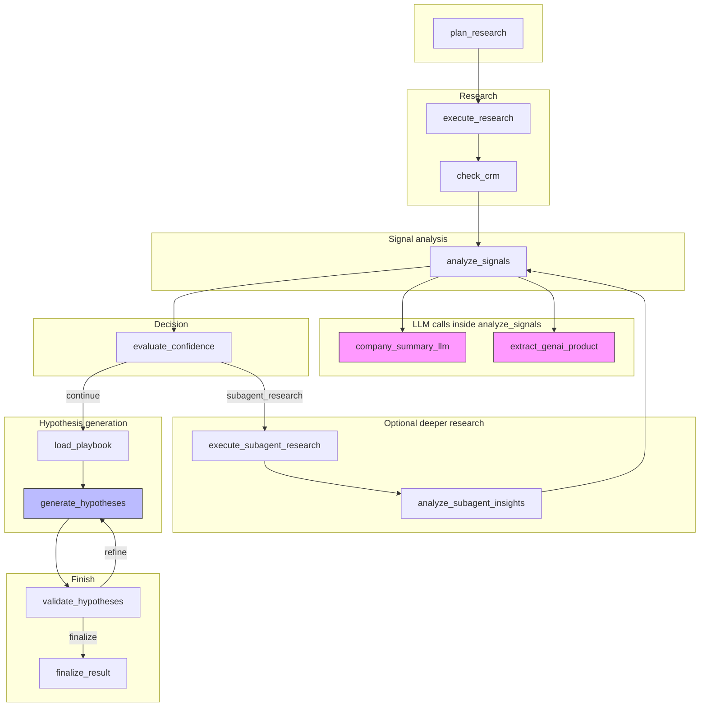
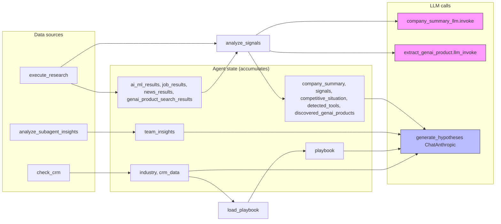

# Hypothesis research trace: flow and where LLM inputs come from

This document explains how the hypothesis research steps fit together and **where each LLM call gets its input**.

---

## 1. Where the **generate_hypotheses** LLM input comes from

The **ChatAnthropic** call under **generate_hypotheses** (the big ~31s call) gets its input from a **single prompt** built inside **`research_agent._generate_hypotheses()`**. That prompt is assembled from **agent state** produced by **earlier nodes**:

| Prompt section | State key(s) | Produced by |
|----------------|--------------|-------------|
| Company name | `company_name` | Request input |
| GenAI product section | `discovered_genai_products` | **analyze_signals** (extract_genai_product) |
| Value drivers | `_get_relevant_value_drivers(industry)` | **check_crm** (industry) |
| Detailed research / sub-agent findings | `team_insights` | **analyze_subagent_insights** (or default text if no subagent run) |
| **COMPANY SUMMARY** | `company_summary` | **analyze_signals** → company_summary_llm |
| **SIGNALS FOUND** | `signals` | **analyze_signals** (keyword extraction) |
| **INDUSTRY PLAYBOOK** | `playbook` | **load_playbook** (uses `industry` from **check_crm**) |
| **COMPETITIVE SITUATION** | `competitive_situation`, `detected_tools` | **analyze_signals** (detect_competitors) |

So the **generate_hypotheses** LLM input is **all of the above**: research results, company summary, signals, playbook, competitive context, and value drivers, formatted into one long prompt. The **hypothesis_agent.generate_hypotheses** span in Arize now has **metadata.llm_input_sources** describing this.

---

## 2. End-to-end flow diagram



---

## 3. Data-flow diagram (what feeds each LLM)



---

## 4. Trace tree (how it looks in Arize)

```
sa_call_analyzer.hypothesis_research
└── LangGraph
    ├── plan_research
    │   └── ChatAnthropic          ← input: plan prompt (company name from request)
    ├── execute_research           ← fills ai_ml_results, job_results, news_results, genai_product_search_results
    ├── check_crm                  ← fills industry, crm_data
    ├── analyze_signals
    │   ├── ChatAnthropic          ← (instrumentor) same as company_summary_llm.invoke
    │   ├── company_summary_llm
    │   │   └── company_summary_llm.invoke   ← input: prompt from ai_ml_results, job_results, news_results
    │   └── hypothesis_agent.extract_genai_product
    │       └── extract_genai_product.llm_invoke   ← input: genai_product_search_results
    ├── evaluate_confidence
    ├── load_playbook              ← fills playbook (from industry)
    ├── generate_hypotheses
    │   └── ChatAnthropic          ← input: full prompt from company_summary, signals, playbook, etc. (see table above)
    ├── validate_hypotheses
    └── finalize_result
```

---

## 5. Quick reference: LLM input sources

| LLM call (span) | Where input is built | Main state keys / sources |
|-----------------|----------------------|----------------------------|
| **plan_research** → ChatAnthropic | `_plan_research`, Arize Prompt Hub or built-in | `company_name` (request) |
| **company_summary_llm.invoke** | `SignalExtractor.analyze_with_llm()` | `ai_ml_results`, `job_results`, `news_results` (from execute_research) |
| **extract_genai_product.llm_invoke** | `_analyze_signals` | `genai_product_search_results` (from execute_research) |
| **generate_hypotheses** → ChatAnthropic | `_generate_hypotheses()` | `company_summary`, `signals`, `playbook`, `industry`, `discovered_genai_products`, `competitive_situation`, `detected_tools`, `team_insights`, value_driver_context |

All of these state keys are populated by earlier nodes in the graph before the LLM is called.
